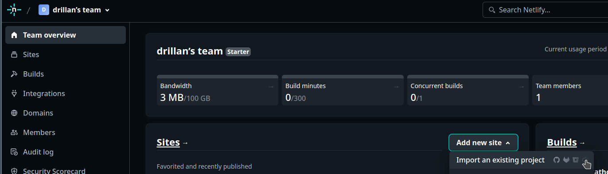

# Netlifyへのホスト

ここでは  で作成したリポジトリを使って、Netlifyにホストします。

[Netlify](https://app.netlify.com/) にログインし、「Add new site」から「Import an existing project」をクリックします。

「Deploy with GitHub」をクリックします。

作成したリポジトリを選択して、クリックします。

下記の項目を入力し、「Deploy site-name」をクリックします（site-nameは、下記で指定したSite name）。

- Site name: ほかと重複しない任意の名前
- Build command: `make html`
- Publish directory: `_build/html`

「Production deploys」が `Published` になったら、デプロイが完了です。「Production: main@HEAD Published」をクリックします。

「Published deploy for site-name」（site-nameは、指定したSite name）の「Open production depoy」をクリックすると、作成したサイトが表示されます。

