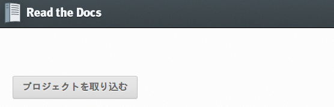
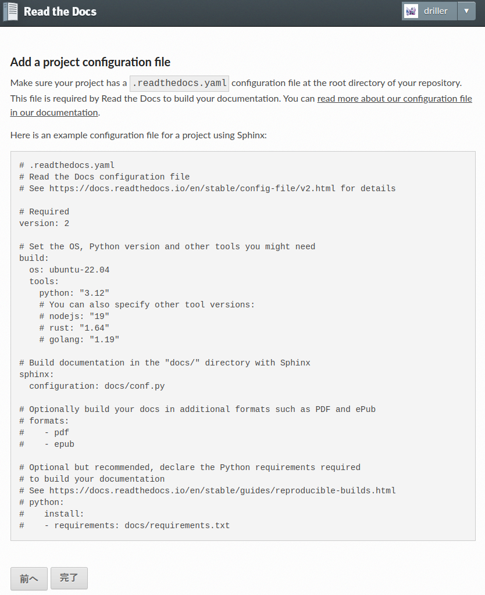

(hosting-rtd)=
# Read the Docsへのホスト

GitHubのリポジトリを作成します。ここでは `my-first-sphinx-docs` とします。ビルドしたファイルなどを除外するため、 `Add .gitignore
` で `Python` を選択します。


`.gitignore` ファイルを作成し、 `.venv` と `_build/` を無視します。

```{code-block}
---
caption: .gitignore
---

.venv
_build/
```

`requirements.txt` ファイルを作成し、必要なパッケージを記述します。

```{code-block}
---
caption: requirements.txt
---

Sphinx
myst-parser
```

`.readthedocs.yaml` を作成し、Read the Docsの設定を記述します。

```{code-block} yaml
---
caption: .readthedocs.yaml
---

version: 2

build:
  os: "ubuntu-22.04"
  tools:
    python: "3.10"

python:
  install:
    - requirements: requirements.txt

sphinx:
  configuration: conf.py
```

コミットし、GitHubへプッシュします。 `your_github_account` はGitHubアカウント名を指定します。

```{code-block} bash
---
caption: コミットとGitHubへプッシュ
---

$ git init -b main
$ git remote add origin git@github.com:your_github_account/my-first-sphinx-docs.git
$ git add .
$ git commit -m "first commit"
$ git push origin main
```

[Read the Docs](https://readthedocs.org/) へログインし、「プロジェクトを取り込む」をクリックします。



リポジトリをimportします、ここでは「手動import」をクリックします。


必要事項を入力し、「次へ」をクリックします。

- 名前: 任意（既存のプロジェクトと重複しない名前にする）
- リポジトリURL: リポジトリのURL
- デフォルトブランチ: main


「完了」をクリックします。



自動でビルドが開始します、「ビルド」をクリックし、ビルドが成功したら、「開く」をクリックすると、ビルドされたHTMLを確認できます。


